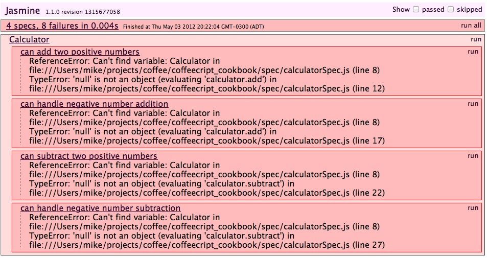
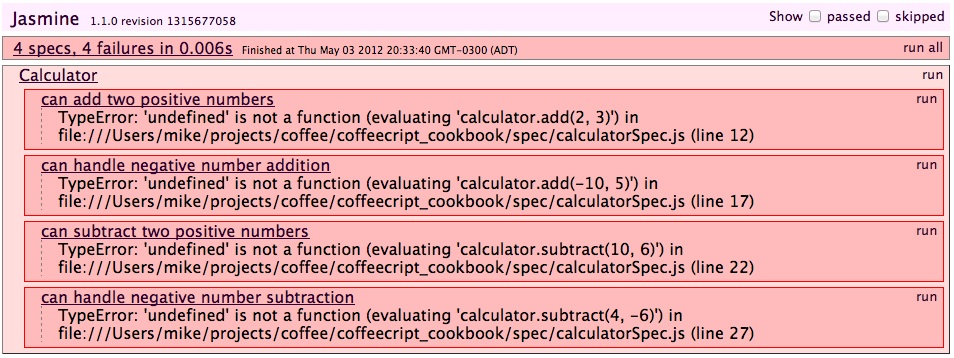
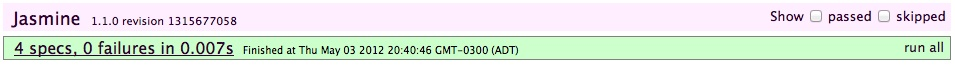

## Problem

You are writing a simple calculator using CoffeeScript and you want to verify it functions as expected.  You decide to use the <a href="http://jasmine.github.io/" target="_blank">Jasmine</a> test framework.

## Discussion

When using the Jasmine test framework, you write tests in a specification (spec) file that describes the expected functionality of the code to be tested.

For example, we expect our calculator will be able to add and subtract and will function correctly with both positive and negative numbers.  Our spec is listed below.



# calculatorSpec.coffee

describe 'Calculator', ->

	it 'can add two positive numbers', ->
		calculator = new Calculator()
		result = calculator.add 2, 3
		expect(result).toBe 5

	it 'can handle negative number addition', ->
		calculator = new Calculator()
		result = calculator.add -10, 5
		expect(result).toBe -5

	it 'can subtract two positive numbers', ->
		calculator = new Calculator()
		result = calculator.subtract 10, 6
		expect(result).toBe 4

	it 'can handle negative number subtraction', ->
		calculator = new Calculator()
		result = calculator.subtract 4, -6
		expect(result).toBe 10



### Configuring Jasmine

Before you can run your tests, you must download and configure Jasmine.  This involves:
1. downloading the latest <a href="https://github.com/pivotal/jasmine/tree/master/dist" target="_blank">Jasmine</a> zip file;
2. creating a spec and a spec/jasmine folder in your project;
3. extracting the downloaded Jasmine files into the spec/jasmine folder; and
4. creating a test runner.

### Create a Test Runner

Jasmine can run your tests within a web browser by using a spec runner HTML file.  The spec runner is a simple HTML page that links the necessary JavaScript and CSS files for both Jasmine and your code.  A sample is below.



<!DOCTYPE HTML PUBLIC "-//W3C//DTD HTML 4.01 Transitional//EN"
  "http://www.w3.org/TR/html4/loose.dtd">
<html>
<head>
  <title>Jasmine Spec Runner</title>
  <link rel="shortcut icon" type="image/png" href="spec/jasmine/jasmine_favicon.png">
  <link rel="stylesheet" type="text/css" href="spec/jasmine/jasmine.css">
  
  
  
  

  <!-- include source files here... -->
  

  <!-- include spec files here... -->
  

</head>

<body>
  
</body>
</html>



This spec runner can be downloaded from this GitHub <a href="https://gist.github.com/2623232" target="_blank">gist</a>.

To use the SpecRunner.html, simply reference your compiled JavaScript files and compiled tests after jasmine.js and its dependencies.

In the above example, we include our yet-to-be-developed calculator.js file on line 14 and our compiled calculatorSpec.js file on line 17.

## Running the Tests

To run our tests, simply open SpecRunner.html in a web browser.  In our example we see 4 failing specs with a total of 8 failures (below).

It appears our tests are failing because Jasmine cannot find the variable Calculator.  That's because it has not been created yet.  Let's do that now by creating a new file named js/calculator.coffee.



# calculator.coffee

window.Calculator = class Calculator



Compile calculator.coffee and refresh the browser to re-run the test suite.

We now have 4 failures instead of our previous 8.  That's a 50% improvement with only one line of code.

## Getting the Tests to Pass

Let's implement our methods and see if we can get these tests to pass.



# calculator.coffee

window.Calculator = class Calculator
	add: (a, b) ->
		a + b

	subtract: (a, b) ->
		a - b 



When we refresh we see they all pass.

## Refactoring the Tests

Now that our tests pass, we should look to see if our code or our test(s) can be refactored.

In our spec file, each test creates its own calculator instance.  This can make our tests quite repetitive especially for larger test suites.  Ideally, we should consider moving that initialization code into a routine that runs before each test.  

Luckily Jasmine has a beforeEach function just for this purpose.



describe 'Calculator', ->
	calculator = null

	beforeEach ->
		calculator = new Calculator()

	it 'can add two positive numbers', ->
		result = calculator.add 2, 3
		expect(result).toBe 5

	it 'can handle negative number addition', ->
		result = calculator.add -10, 5
		expect(result).toBe -5

	it 'can subtract two positive numbers', ->
		result = calculator.subtract 10, 6
		expect(result).toBe 4

	it 'can handle negative number subtraction', ->
		result = calculator.subtract 4, -6
		expect(result).toBe 10



When we recompile our spec and refresh the browser we see the tests still all pass.

