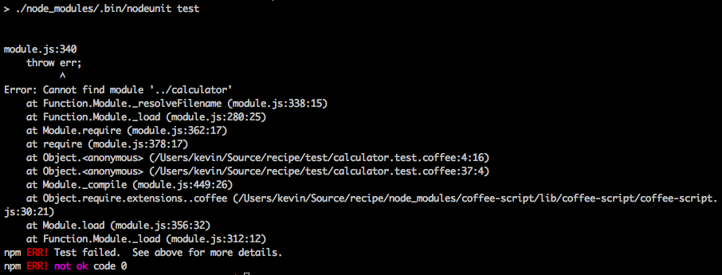
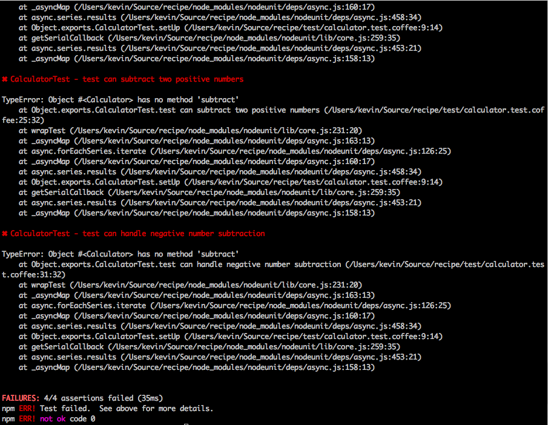
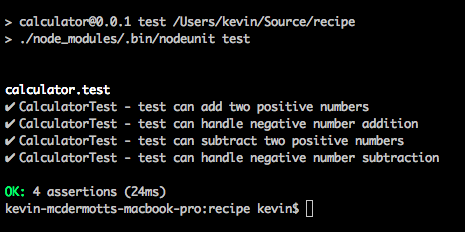

## Problem

You are writing a simple calculator using CoffeeScript and you want to verify it functions as expected.  You decide to use the <a href="https://github.com/caolan/nodeunit" target="_blank">Nodeunit</a> test framework.

## Discussion

Nodeunit is a JavaScript implementation of the xUnit family of Unit Testing libraries, similar libraries are available for Java, Python, Ruby, Smalltalk etc.

When using xUnit family test frameworks, you write tests in a file that describes the expected functionality of the code to be tested.

For example, we expect our calculator will be able to add and subtract and will function correctly with both positive and negative numbers.  Our test is listed below.



# tests/calculator.test.coffee

Calculator = require '../calculator'

exports.CalculatorTest =

    'test can add two positive numbers': (test) ->
        calculator = new Calculator
        result = calculator.add 2, 3
        test.equal(result, 5)
        test.done()

    'test can handle negative number addition': (test) ->
        calculator = new Calculator
        result = calculator.add -10, 5
        test.equal(result,  -5)
        test.done()

    'test can subtract two positive numbers': (test) ->
        calculator = new Calculator
        result = calculator.subtract 10, 6
        test.equal(result, 4)
        test.done()

    'test can handle negative number subtraction': (test) ->
        calculator = new Calculator
        result = calculator.subtract 4, -6
        test.equal(result, 10)
        test.done()



### Installing Nodeunit

Before you can run your tests, you must install Nodeunit:

First of allcreate a package.json file


{
  "name": "calculator",
  "version": "0.0.1",
  "scripts": {
    "test": "./node_modules/.bin/nodeunit test"
  },
  "dependencies": {
    "coffee-script": "~1.4.0",
    "nodeunit": "~0.7.4"
  }
}


Next from a terminal run.


$ npm install


## Running the Tests

It's easy to run the tests from the command-line:


$ npm test


The test runner should fail, because we have no calculator.coffee

Let's create a simple file 



# calculator.coffee

class Calculator

module.exports = Calculator


And re-run the test suite.

## Getting the Tests to Pass

Let's implement our methods and see if we can get these tests to pass.



# calculator.coffee

class Calculator

  add: (a, b) ->
    a + b

  subtract: (a, b) ->
    a - b

module.exports = Calculator


When we rerun the tests we see they're all passing:

## Refactoring the Tests

Now that our tests pass, we should look to see if our code or our test(s) can be refactored.

In our test file, each test creates its own calculator instance.  This can make our tests quite repetitive especially for larger test suites.  Ideally, we should consider moving that initialization code into a routine that runs before each test.  

In common with other xUnit libraries, Nodeunit provides a setUp (and tearDown) function which will be called before each test.



Calculator = require '../calculator'

exports.CalculatorTest =

    setUp: (callback) ->
        @calculator = new Calculator
        callback()

    'test can add two positive numbers': (test) ->
        result = @calculator.add 2, 3
        test.equal(result, 5)
        test.done()

    'test can handle negative number addition': (test) ->
        result = @calculator.add -10, 5
        test.equal(result,  -5)
        test.done()

    'test can subtract two positive numbers': (test) ->
        result = @calculator.subtract 10, 6
        test.equal(result, 4)
        test.done()

    'test can handle negative number subtraction': (test) ->
        result = @calculator.subtract 4, -6
        test.equal(result, 10)
        test.done()



We can rerun the tests and everything should continue to pass.

